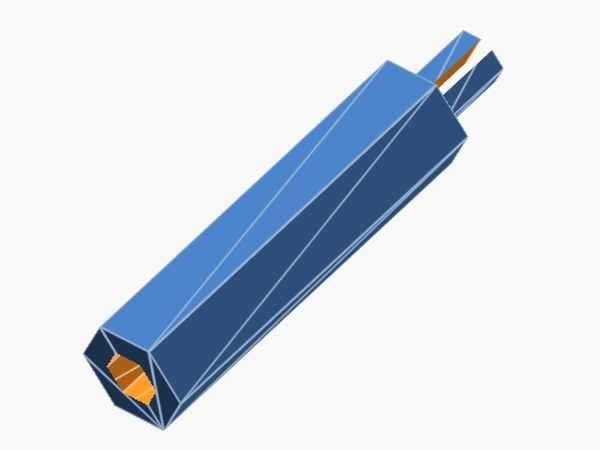
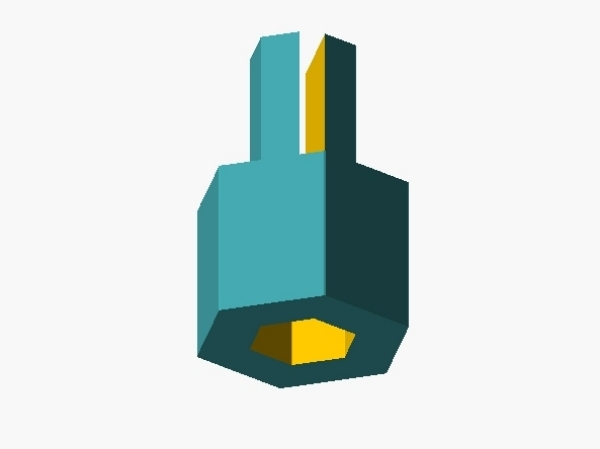
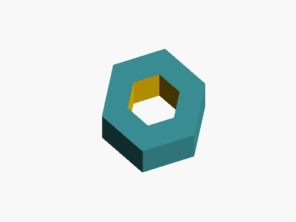

# Programmable Hex Standoff

Project was created in [OpenSCAD](https://github.com/openscad/openscad)

You can configure parameters of:
- top pin
- distance between the halves of a top pin
- base
- bottom hole

Just play with variables described on top
of [hex-standoff.scad](files/hex-standoff.scad)
file and get result which you need.

## Defaults samples (in millimeters)

### Base

STL file can be found [here](files/hex-standoff_base.stl).

| Part        | Height | Width |
|-------------|--------|-------|
| Top Pin     | 5      | 3     |
| Distance    | 5      | 0.8   |
| Base        | 24     | 6     |
| Bottom Hole | 4      | 3     |

### Foot cap

STL file can be found [here](files/hex-standoff_foot.stl).

| Part        | Height | Width |
|-------------|--------|-------|
| Top Pin     | 5      | 3     |
| Distance    | 5      | 0.8   |
| Base        | 5      | 6     |
| Bottom Hole | 4      | 3     |

### Head cap

STL file can be found [here](files/hex-standoff_head.stl).

| Part        | Height | Width |
|-------------|--------|-------|
| Base        | 5      | 6     |
| Bottom Hole | 5      | 3     |

## Similar projects from ThingVerse

* https://www.thingiverse.com/thing:1528494 (my inspiration)
* https://www.thingiverse.com/thing:2761026
* https://www.thingiverse.com/thing:3251614
* https://www.thingiverse.com/thing:2884417

## Links

* $this project was created as part of [Kubernetes cluster on ARM](https://github.com/EvilFreelancer/kubernetes-cluster-on-arm)
* YouTube [Openscad : Simple Hexagon shape](https://www.youtube.com/watch?v=KAKEk1falNg)
